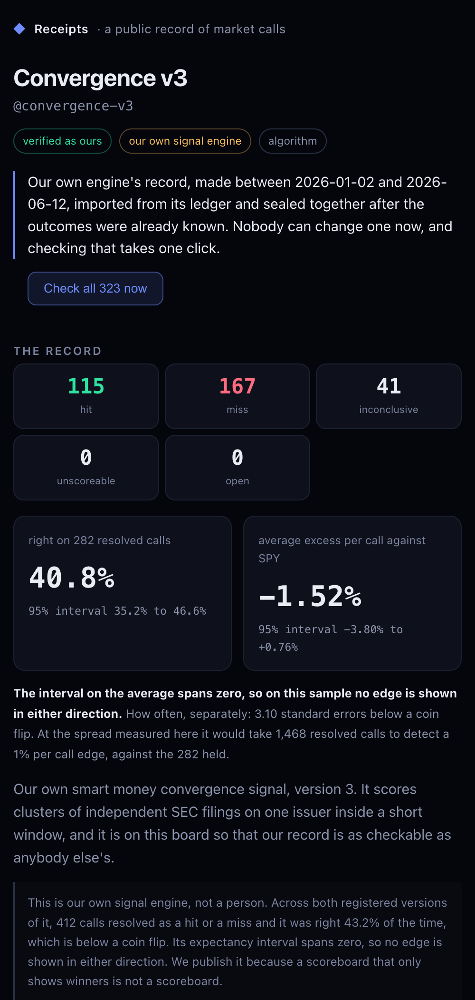
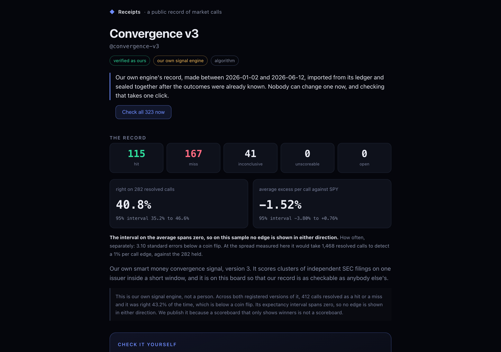

# Receipts

**A public, permanent record of market calls: publish a dated call before the outcome is known, and
anyone can check it was never edited.**

<p align="center">
  
</p>

<p align="center">
  
</p>

*(The record in those screenshots is our own, and it is bad: 40.8% right. That is the point —
see "The record on the board is ours and it loses" below.)*

---

## Sixty-second quickstart

You need Docker and one free API key. No card, no paid tier, no second service.

```bash
git clone <this repository> receipts && cd receipts
./scripts/setup.sh              # writes .env with a generated database password
```

Then get an Alpaca key — free, no card — at <https://app.alpaca.markets/signup>, open the
paper-trading dashboard, press **Generate** under *API Keys*, and paste both halves into `.env`:

```
ALPACA_API_KEY_ID=...
ALPACA_API_SECRET_KEY=...
```

```bash
make quickstart                 # builds, migrates, loads a month of closes for every symbol
```

Open <http://localhost:8000>, register, claim a handle, publish a call.

If prices do not appear, `docker compose exec -T api python -m tradeos.cli check-source alpaca`
makes a real request and tells you which half of the credential is wrong.

**The quickstart loads a short window over every symbol rather than a long window over a few**, and
that is not an arbitrary trade. A call is scored on the sessions *after* it is published — entry is
the close of the first session following publication — so a fresh install needs the symbol to
exist with a recent session, not a year of history behind it. Measured on a clean clone:
**13,170 symbols, 12,930 with data, 176,000 rows, 65 seconds.**

The first version of this loaded 400 symbols over a year instead, and it is worth saying why it was
wrong: the work list sorts by staleness, everything on a fresh database is equally stale, so it
falls back to sorting by symbol and you get `A, AA, AAA, AAAA, AAAC…`. Of twelve names a person
actually reaches for, ten were missing. A stranger's first call is on a company they have heard of.

Deeper history is optional and nothing needs it to work:

```bash
docker compose exec -T api python -m tradeos.cli ingest-prices --universe --start 2024-01-01
```

That is about 3.5 hours for a full year. Run it overnight if you want it.

---

## What a caller does

1. **Claim a handle.** One handle, one caller, and it cannot be changed or transferred afterwards.
2. **Publish a call**: a symbol, a direction, a window of 7, 30 or 90 days, a stated confidence,
   and optionally a reason. Three windows and no others, so records are comparable.
3. **It seals.** The call is hashed into that caller's chain at the moment it is published, before
   the outcome exists. Nothing — not the caller, not the operator through the product — can edit or
   delete it afterwards. A database trigger refuses.
4. **It resolves itself.** When the window closes, the call is scored as excess return against SPY
   over the same days, so a call that said *up* in a week the whole market rose is not credited
   with the market's move.
5. **Share the link.** `/r/your-handle` is a server-rendered page with no app chrome, no sidebar,
   no sign-up wall and exactly one outbound link.

A caller never chooses which calls appear. Every one is listed, the misses are shown above the
breakdowns, and open calls carry the reason they are still open and the time we last looked.

---

## What a visitor can verify

Press one button. **Their own browser downloads every sealed call and recomputes every SHA-256 on
their own device** — measured at **323 links in 8 ms**.

That is deliberately not a call to an endpoint that answers `intact: true`. An endpoint like that
is the operator of the database asking to be trusted, on the page whose entire argument is that you
do not have to. The server hands over the sealed fields and states no verdict.

And the page will **break its own record in front of you**: "Now show me it failing" changes one
character of one thesis in your browser and reruns the same code, which reports the tamper and
names the call. A check that can only ever say yes is indistinguishable from a green sticker.

The same check runs with no server at all:

```bash
docker compose exec -T api python -m tradeos.cli export-records --out export
node export/check.mjs
```

```
ok    convergence-v3: 323 links in 8 ms, head c9f480e0a79a28c7  [SEALED BACKTEST - see README]
ok    convergence-v4: 150 links in 3 ms, head 24df0daed4f23ccd  [SEALED BACKTEST - see README]
ok    and it says no when it should: the stored hash does not match the call's own contents at call #1
```

`export/check.mjs` uses `receipts/verify.js` itself, copied verbatim, not a reimplementation.

---

## What it does NOT guarantee

**The chain does not prove that WE have not rewritten it.** We hold every field, so this operator
could edit a call and recompute the whole chain after it. Making that impossible needs an anchor
outside our control, publishing the chain head daily somewhere we cannot revise, and that is not
built yet. This is not a blockchain and we do not call it one.

That sentence is on the public page, printed directly beneath the Verify result, at the moment a
visitor is most impressed. It is the same string, read from one place, so the page and this file
cannot drift.

Four more limits, each of which is also stated in the product:

**No rate below 25 resolved calls.** A hit rate is not shown until 25 calls have resolved as a hit
or a miss. Below that the interval around any rate is wider than the differences a reader would be
trying to judge. The counts are shown instead, and every call is still listed.

**A 2% noise floor.** A move inside plus or minus 2% against the benchmark is recorded as
*inconclusive* rather than counted either way. Counting small moves as hits is the easiest way to
manufacture a track record.

**The noise floor does not always hold.** Prices are end-of-day closes from a single free feed,
which carries one exchange's prints rather than the consolidated tape. Measured against an
independent feed over 961 day-pairs, closes differ by 0.391% on average — well inside the floor.
But that average hides a thin-name tail: on the least liquid symbols measured the two feeds
disagreed by **2.86%**, which is *larger than the floor that exists to absorb exactly this*. On a
thinly traded symbol the choice of price feed can move a call across the line by itself, and
because a verdict is sealed and never revised, it stays moved. Read a verdict on an illiquid name
with that in mind.

**No prices are shown anywhere.** They come from a market-data vendor whose terms do not permit
redistributing their data, and those terms carry no exception for displaying it. What is published
is the measurement; the prices it was measured from are kept, sealed and unchangeable, so a verdict
can still be answered for. Both session dates are shown so you can recompute any result yourself
from any price source you choose: take the close on the entry session and on the exit session for
the symbol, do the same for the benchmark, and subtract the benchmark's move from the symbol's.

**Nobody's identity is verified.** There is no email confirmation and no audience check, so the
only thing standing behind a handle is an address nobody has confirmed. The record page says so in
as many words. The distinction is the real one: identity verification is about *who is speaking*,
and the seal is about *what was said*.

`docs/known_gaps.md` is the full list, one entry per thing that is absent by decision, each naming
the sentence the product itself says about it.

---

## The record on the board is ours and it loses

The first two records are our own signal engine's, imported from its ledger: **@convergence-v3**
(323 calls) and **@convergence-v4** (150). Pooled, they read **43.2% right on 412 resolved calls**
— below a coin flip, 2.76 standard errors below it — with an average excess return per call of
**−1.18%** and a 95% interval of **[−2.93%, +0.57%]** that spans zero. At that dispersion it would
take 1,268 resolved calls to detect a 1% per-call edge.

Two things about those numbers are worth being precise about, because they disagree:

* **The frequency is significant** and it is bad.
* **The return is not significant in either direction** — the interval spans zero, so no edge is
  demonstrated. Saying "it does not work" would overclaim in the other direction.

**And those 473 calls are a SEALED BACKTEST, not foresight.** They were imported from an
already-scored ledger and sealed together after their outcomes were known. They demonstrate the
machinery over a real sample; they are not predictions published in advance. Every surface that
shows them says so — the record page's own sealing line, the export's README, and `check.mjs`'s
output. A call published through the product is sealed at publication, before the outcome exists.
That is the claim, and these records are not evidence for it.

---

## Engineering

**The append-only trigger.** A call is written once and scored once. Before resolution only the
resolution columns may be filled in; after resolution nothing may change, *including the nine
figures the verdict was computed from* — an earlier version sealed the verdict and left
`excess_return` editable, so `UPDATE calls SET excess_return = 0.42 WHERE verdict = 'miss'`
succeeded and every hash still verified, because the arithmetic is not a sealed field. Deletes are
refused outright. It is a database trigger, not application code, so it holds against `psql`.

**A per-caller hash chain, verified in the browser.** Ten sealed fields, framed as
`name:byte-length:value` and joined with newlines, hashed as `sha256(prev_hash + payload)`. The
length prefix is why a caller cannot type a delimiter into their own thesis and make two different
calls serialise identically. The length is in **bytes**, not characters, so a four-byte emoji in a
thesis is one character and four bytes. The wire format has two implementations — `chain.py` and
`verify.js` — because the client half is the part worth computing independently, and they are
pinned to one committed fixture from both languages (`make test-js`).

**The scoring invariant: a call is sealed `unscoreable` if and only if no price series exists for
its symbol.** Nothing else may seal, and in particular no gap in *our* benchmark, ever. A symbol
whose feed is merely behind is perfectly scoreable and our data is late; sealing that would be
wrong an hour later and uncorrectable forever. So a missing exit price always leaves a call **open**
with a stored reason and the time we last checked, and a lagging benchmark **blocks publishing**
rather than accepting a permanent commitment we cannot price.

**The zero-output alarm.** A scheduler job that ran, found work, and did none of it used to be
recorded exactly like one that succeeded. That is how this codebase lost a month of production to
five weeks of green. A job with work to do that produces none of it on two consecutive runs is now
recorded as `warning`.

**Reproducible research.** The signal behind those two house records was measured properly and the
result was negative. `docs/research/insider_buying.md` states what was tested, the window, the
method, the result, the one positive cut and why it should not be believed, six reasons it may
differ from the published literature, and the exact commands plus a module hash to reproduce it.

**The stack.** Python 3.12, FastAPI, PostgreSQL 16, React + Vite. No ORM (raw parameterised SQL),
no migration framework (ordered `.sql` files), no state library, no CSS framework.
`requirements.txt` is ten lines. One external service.

**The internal package is `tradeos`**, and it stays that way. The display name lives in
`config.brand_name()` and `frontend/src/brand.js` — set `BRAND_NAME` to put your own on your own
board. Renaming the package would mean renaming database tables, and `schema_migrations` and the
append-only triggers are matched by name: a half-finished rename against a live database is how a
sealed table loses its trigger.

---

## The research

**[Clustered insider buying, measured over 25 months: no edge, and the sign is
wrong](docs/research/insider_buying.md)** — our own signal, measured, negative. −3.40% mean excess
versus SPY at 90 days, 95% interval [−5.40%, −1.40%], n=442. It reports the one positive cut it
found and explains why that cut should not be believed, and it does not claim insider buying fails
in general: it claims this construction, over this window, measured this.

---

## More

* [`docs/known_gaps.md`](docs/known_gaps.md) — what is deliberately not built, and the sentence the
  product says about each one.
* [`SECURITY.md`](SECURITY.md) — how to report something, and what is in scope.
* [`CONTRIBUTING.md`](CONTRIBUTING.md) — three rules that are not negotiable, and why.
* [`LICENSE`](LICENSE) — MIT.

---

**This platform measures publicly stated market calls. It is not investment advice, it is not a
recommendation, and no position on the board is an endorsement of any person. Past performance does
not predict future results.**
